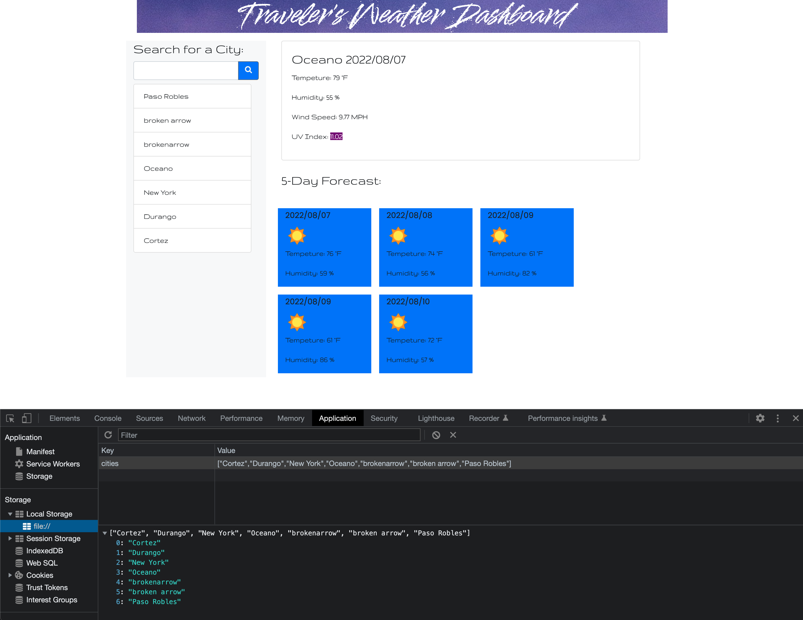

# Module 6 - Traveler's Weather Dashboard

## Websites

- Deployed app [Traveler's Weather Dashboard](https://iamjoyfulgirl.github.io/travelers-weather-dashboard/)
- [GitHub Repository](https://github.com/iamjoyfulgirl/travelers-weather-dashboard)

## Description of the Traveler's Weather Dashboard

This front-end application allows a user to look up multiple locations' 5-day forecasts to plan their trip accordingly. This is accomplished using the OpenWeather API and saving the user's location search data to local storage.



## Application Functionality

The user enters a city name into the search field and clicks the search button. The city name is passed into the OpenWeather API, which returns the current weather and the next four days' weather into the future.

The current day's weather is displayed in it's own section and includes temperature, humidity, wind spedd and UV index. Additionally, each day's weather is shown on a blue card with date, weather condition-related icon, temperature, and humidity.

## Technologies Used

- HTML
- Bootstrap CSS framework
- IonIcon for search button icon
- CSS
- JQuery
- [OpenWeather One Call API](https://openweathermap.org/api/one-call-api)

## Link to the Traveler's Weather Dashboard

[Traveler's Weather Dashboard Demo Video](https://drive.google.com/file/d/1CdI-fiPRbA8uXu0kY2PMYXXJ20fMXMp0/view)

## Acceptance Criteria

```
GIVEN a weather dashboard with form inputs
WHEN I search for a city
THEN I am presented with current and future conditions for that city and that city is added to the search history
WHEN I view current weather conditions for that city
THEN I am presented with the city name, the date, an icon representation of weather conditions, the temperature, the humidity, the wind speed, and the UV index
WHEN I view the UV index
THEN I am presented with a color that indicates whether the conditions are favorable, moderate, or severe
WHEN I view future weather conditions for that city
THEN I am presented with a 5-day forecast that displays the date, an icon representation of weather conditions, the temperature, the wind speed, and the humidity
WHEN I click on a city in the search history
THEN I am again presented with current and future conditions for that city
```
